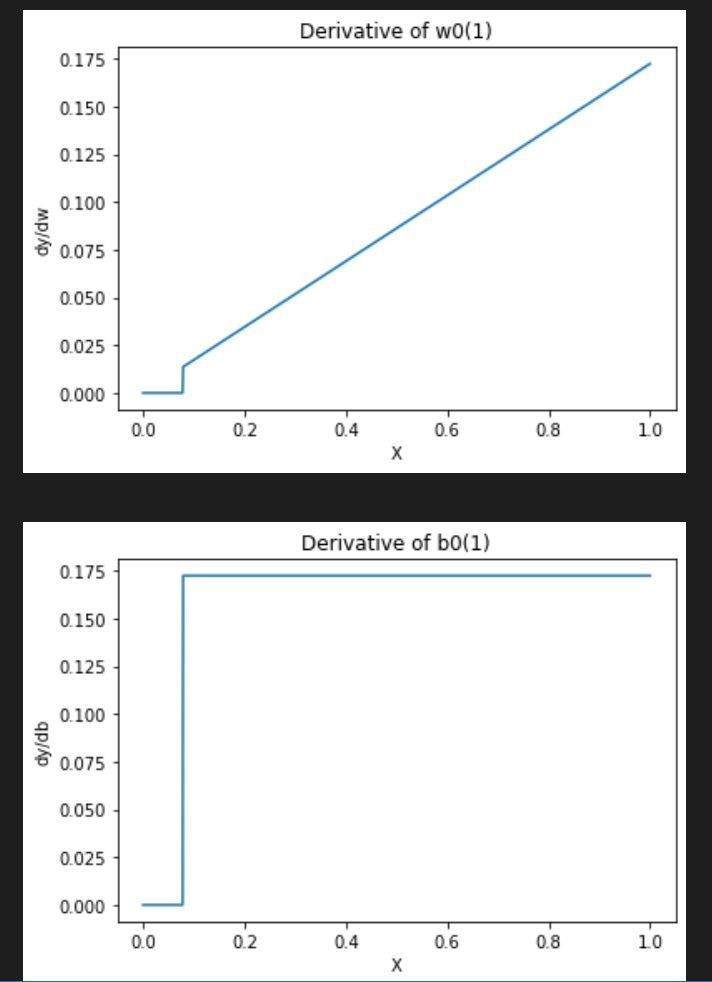
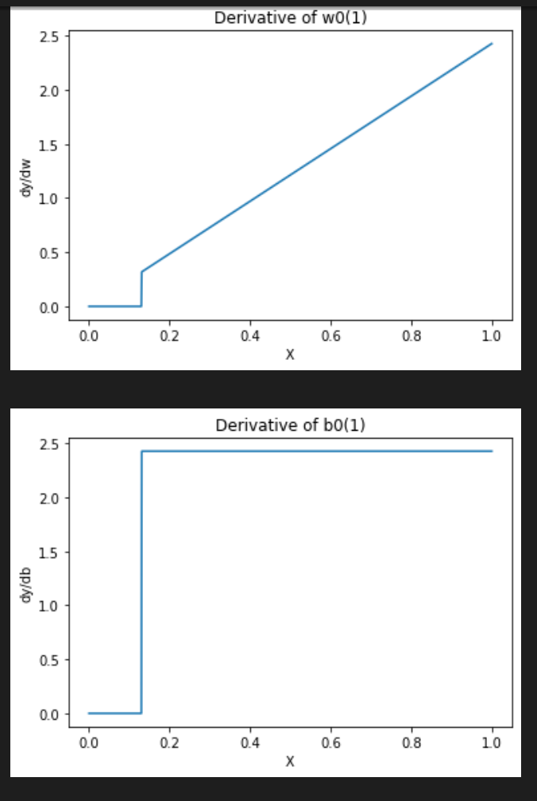
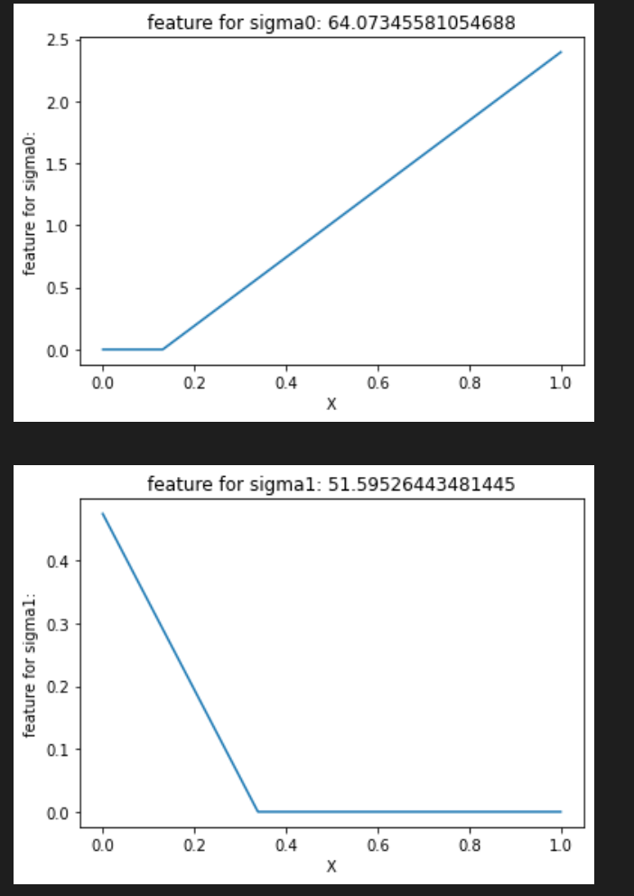
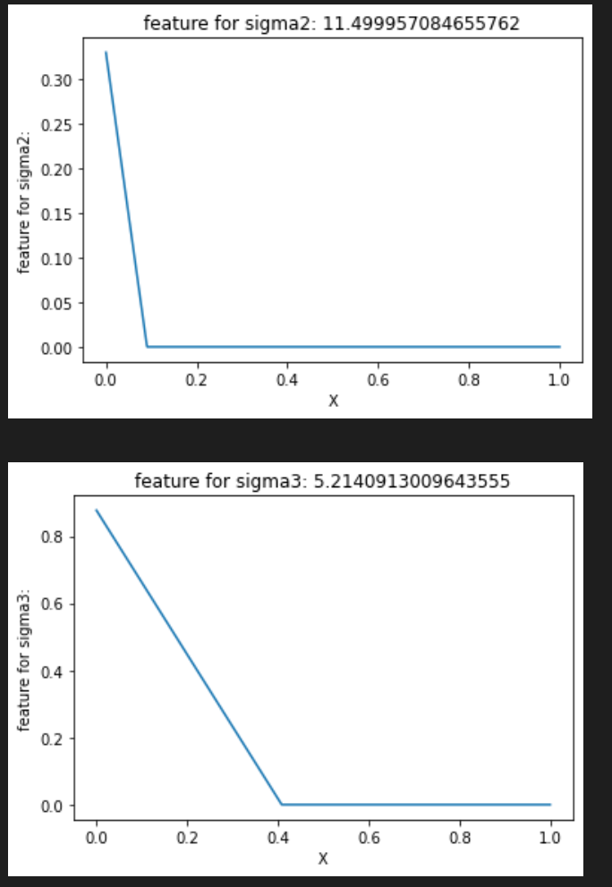
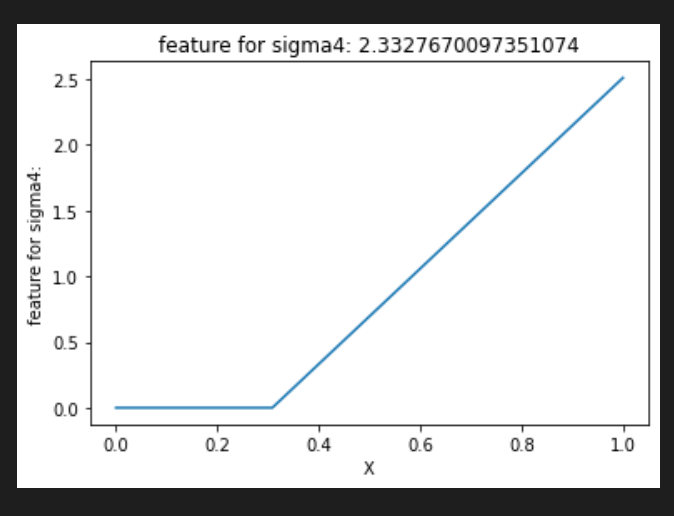
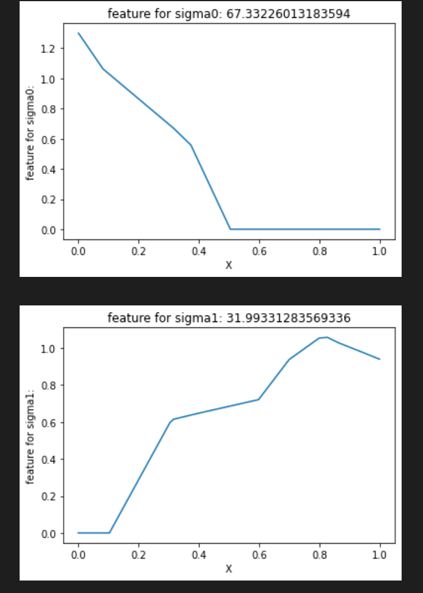
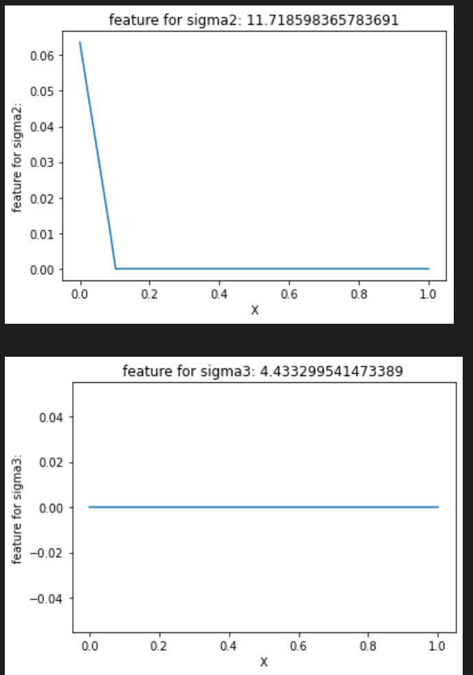
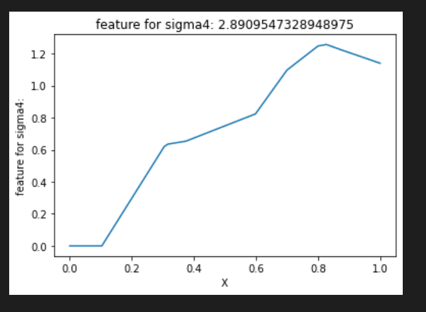

# HW 2

## Problem 3 Visualizing features 

### (a)

#### Initialization:

Since there are 10/20/40 elements of each W(1), I only pick the one whose index is 0 and plot it. b(1) is the same as W(1). 

#### Trained:

### (b)

### (c)

Principle features do change more than others.

### (d)

(Not sure)